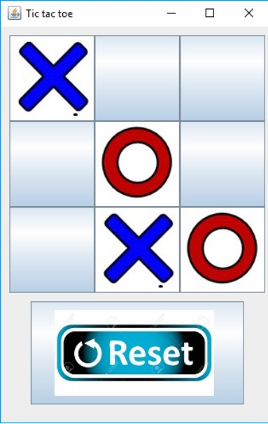

# Readme

Ejercicio sobre "[Líneas de Producto de Software](https://en.wikipedia.org/wiki/Software_product_line)" de la asignatura "Diseño Industrial de Software", del grado Ingeniería Informática cursada en la [Universidad Pública del País Vasco](https://ehu.eus).

El ejercicio consiste en modificar un juego simple existente, en este caso un tres en raya, añadiendo la siguiente variabilidad al juego:

- Iconos de los iconos (X y O)
- Opciones para el oponente: persona, máquina o ambos
- Opción de mostrar un apartado "about" y opcionalmente añadir la url del código fuente
- Opción de llevar una cuenta de las victorias de cada jugador y de forma opcional el número de victorias consecutivas.

El proyecto se ha desarrollado en [Eclipse Modeling Tools](https://www.eclipse.org/downloads/packages/release/2021-12/r/eclipse-modeling-tools) y [feature-ide](https://marketplace.eclipse.org/content/featureide) con el compositor "FeatureHouse".

## Enunciado

Crear una línea de producto software a partir de un software existente (un programa) que contiene toda su funcionalidad.

El programa de partida es la aplicación **TicTacToe**, un juego implementado en Java disponible en Internet.
Se debe modificar el programa para dar lugar a un SPL con varios productos diferentes. Este SPL debe generar sencillas variantes de este juego, cambiando los iconos o la manera de implementar la lógica del juego.

El juego de tres en raya utiliza cuatro iconos (X, O y una versión de los mismos remarcada para indicar una jugada ganadora). Los juegos generados con este SPL tienen tres colecciones diferentes de iconos. Una versión con las fichas hechas a mano (*Icons_Hand*, Figuras 1 y 4), la versión con las fichas en rojo y azul (*Icons_BlueRed*, Figura 2, 5 y 6), y la versión con fichas en morado (*Icons_Purple*, Figura 3 y 7).

|  |  |
| :-------------------------------: | :-------------------------------: |
|             Figura 1              |             Figura 2              |
|  |  |
|             Figura 3              |             Figura 4              |
|  |  |
|             Figura 5              |             Figura 6              |
|  |                                   |
|             Figura 7              |                                   |

## Tareas

Véase `Tareas.md`