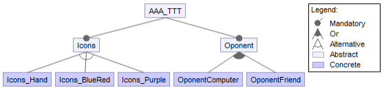

# Tareas a realizar

- [x] 1.  Comprueba que el programa en Java descargado es un programa Java con interfaz gráfica que funciona. Los iconos que se indican en el punto anterior están disponibles en e-gela para su descarga.

- [x] 2. Crea un proyecto de FeatureIDE de nombre *TuApellido* (no literalmente, sino el tuyo).

- [x] 3. Crea una carpeta en el proyecto llamada *original* y coloca en su interior los ficheros de los que partes (los descargados de la url proporcionada) y un fichero *Readme.txt* que incluya tu nombre y apellidos y la url de donde has descargado el programa. Los ficheros de esta carpeta no se tocarán.
     Es para ver la evolución sufrida por el software desarrollado.

- [x] 4. Crea en el proyecto FeatureIDE el modelo de variabilidad que aparece la figura siguiente. Este
     diagrama tendrá que evolucionar con nuevos cambios propuestos más adelante en este enunciado o porque alguna de las características abstractas vaya a contener código común.

     

- [x] 5. Añade una característica opcional llamada *About*. Esta característica debe mostrar en un diálogo emergente el nombre de los autores del programa (el/los del programa original y el tuyo). La característica *About* debe tener otra característica llamada *Url*, que hace que al mensaje anterior se le añada la url donde localizar el código fuente.

- [x] 6. **EXTRA**: Añade otra característica opcional llamada *TrackGames*, que lleve la cuenta el número de partidas ganadas que lleva cada jugador y otra característica *ConsecutiveGames* que cuente también cuántas partidas consecutivas lleva ganadas el ganador. Esto se muestra en un (uno, no dos) diálogo emergente al final de cada partida.

- [ ] 7. Separa el código original asociándolo a características, o añade el necesario si algo no está implementado.
     - No se busca refactorizar el código proporcionado, tan solo distribuirlo.
     - Es posible que algunas características del diagrama en vez de abstractas sean concretas, o viceversa.
     - Solo en ocasiones muy concretas es posible que se deban crear nuevos métodos para recolocar el código mostrado. Si lo necesitas hacer, justifícalo (ver punto 9).
     - Solo crear código para aquellos detalles que no aparezcan implementados en el código original.

- [ ] 8. <u>Crear tres configuraciones</u> asociadas a las características y dejar la tercera por defecto.
     - **FriendHand**: Icons_Hand + OponentFriend + About + Url
     - **ComputerBlueRed**: Icons_BlueRed + OponentComputer + About
     - **ComputerFriendPurple**: Icons_Purple + OponentFriend + OponentComputer + About.

- [ ] 9. Crea un documento que explique someramente los cambios realizados en el código hasta llegar a la versión definitiva. Inclúyelo en la raíz de tu proyecto.

- [ ] 10. Exporta el proyecto a un fichero tuApellido.zip. Súbelo a e-gela.